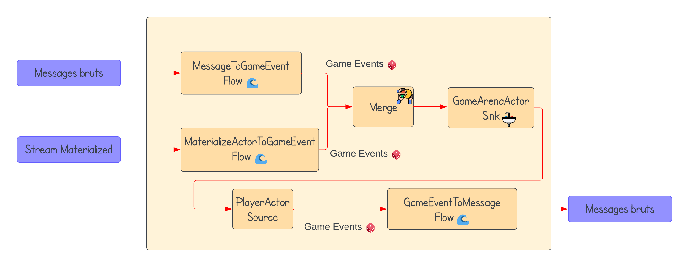
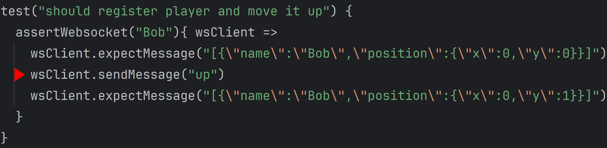
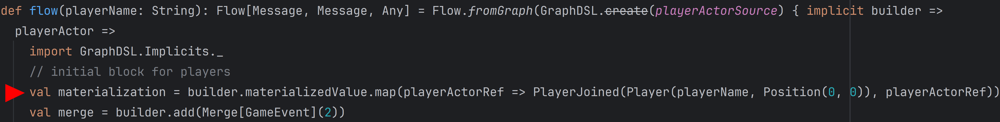
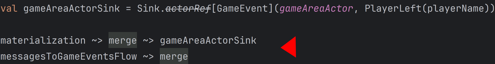
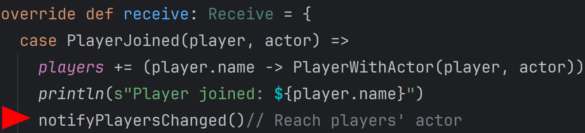
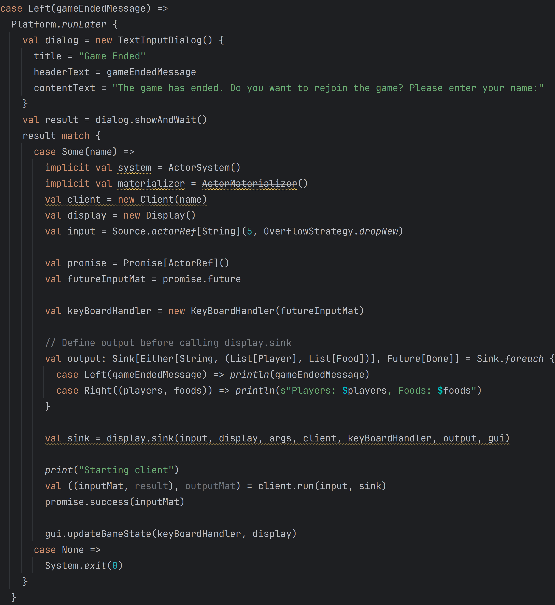

# Projet SR - Rapport Marius Le Douarin

## Qu'est-ce que Akka.Streams ?

Il s'agit d'une bibliothèque de traitement (asynchrone et non bloquant) des flux de données en Scala qui fait partie du framework Akka. Akka est une boîte à outils permettant de créer des applications, basées sur des messages, hautement concurrentes, distribuées et résilientes pour Java et, plus particulièrement ici, pour Scala.

## Pourquoi utiliser Akka.Streams ?

Dans un jeu distribué, où chaque action a son importance, où chaque point de vue importe pour éviter les incohérences dans le gameplay, la gestion des flux de données asynchrones est cruciale pour assurer une expérience de jeu fluide et réactive. Akka.Streams est intéressant sur ce point puisque la bibliothèque implémente de manière robuste le Reactive Streams ("Initiative visant à fournir une norme pour le traitement de flux asynchrone avec une contre-pression non bloquante" selon Wikipédia).

Dans un scénario simple avec un serveur de jeu générant un flux continu d'événements liés aux actions des joueurs, où les clients agissent en tant que consommateurs devant gérer ces flux pour éviter les goulots d'étranglement et les délais excessifs, Akka.Streams offre des solutions telles que la gestion de backpressure (la résistance au flux de données). Cette fonctionnalité permet au système de s'ajuster dynamiquement à la charge, évitant ainsi des latences inacceptables pour les joueurs. De plus, des stratégies de backoff peuvent être mises en œuvre pour moduler la production d'événements en cas d'échec, offrant ainsi une approche robuste pour maintenir la fluidité du gameplay.

Dans ce scénario, cela se traduirait par :
- Les consommateurs demandent jusqu'à N éléments en aval du producteur.
- Les producteurs suivent cette demande, envoyant jusqu'à N éléments au consommateur.
- En cas de succès, le consommateur peut demander un élément supplémentaire à chaque traitement réussi.
- En cas d'échec, le producteur peut remarquer l'absence de demande du consommateur et activer sa stratégie de backoff pour réguler la production ou la consommation de données en cas de problèmes de traitement.

Aussi, Akka.Streams offre des modèles de code réutilisables pour résoudre des problèmes asynchrones courants et évènementiels.
Nous retrouvons parmi ces modèles : comme expliqué précédemment la gestion de backpressure, le groupage d'évènements (par exemple liés aux mouvements des joueurs), le déclenchement diffféré pour des évènements (par exemple au travers de récompenses ou de notifications).

L'avantage aussi d'Akka.Streams, que nous n'aurons malheureusement pas la possibilité d'exploiter à son plein potentiel, nous pouvons retrouver Akka.Persistence, Akka.Streams.Kafka, intégration avec des services clouds (Azure EventHubs...).

Akka.Streams est aussi très avantageux pour les systèmes distribués grâce à des opérateurs qui permettent un traitement des flux simplifié, les trois composants principaux et qui ont été utilisés pendant le projet sont : les *Sources*, les *Flows*, les *Sinks*.

# Source

Les Sources sont des objets qui sont utilisés pour produire une source de données. Cet opérateur a <ins>exactement une sortie</ins>.
Nous retrouvons notamment quelques méthode pour définir une Source :
- Source.empty : Une source vide qui ne produit aucun élément.
- Source.single() : Une source avec un seul élément.
- Source.future(Future) : Une source dont les éléments seront ceux produits par le Future.
- Source.apply(Iterable) : Une source produisant les éléments contenus dans l'itérable donné.

Dans l'exemple :
```scala
val source: Source[String, NotUsed] = Source(
  Seq("5,10", "15,15", "78,79", "12,12", "0,0", "456,456")
)
```

Une Source (ici Source[String, NotUsed] --> la source émet des chaînes de caractères et produit une valeur de type NotUsed, cette valeur est appelée "materialized value") est créée pour produire des paires de nombres entiers séparés par des virgules. Ces paires peuvent être utilisées dans différents contextes, par exemple nous pourrions dire qu'elles représentent le résultat d'une question dans un quiz, où le premier composant représente la réponse de l'utilisateur et le deuxième composant représente la réponse attendue.

# Sink
Les Sinks sont des objets qui permet de définir différentes manières de consommer les éléments d'un stream. Cet opérateur a <ins>exactement une entrée</ins>.
Nous retrouvons notamment quelques méthodes pour définir un Sink :
- Sink.fold(): Un Sink qui fold les éléments du flux, en retournant un Future avec le résultat final.
- Sink.head : Un Sink qui retourne un Future avec le premier élément du flux. Il existe également une alternative, 
Sink.headOption, pour gérer les flux sans élément.
- Sink.last et Sink.lastOption : Similaires à Sink.head et Sink.headOption, mais retournent le dernier élément du flux.
- Sink.foreach : Un Sink qui effectue une action pour chaque élément du flux sans retourner de résultats.
- Sink.seq : Un Sink qui collecte tous les éléments du flux dans une Seq (séquence).

Dans l'exemple : 

```scala
val sink: Sink[Boolean, Future[(Int, Int)]] = Sink.fold((0, 0)) {
  case ((correctCount, total), wasCorrect) =>
    if (wasCorrect) (correctCount + 1, total + 1)
    else (correctCount, total + 1)
}
```

Un Sink est créé pour compter le nombre de valeurs booléennes "true" dans un flux de données de valeurs booléennes. Le Sink utilise la méthode Sink.fold() pour effectuer cette opération. Pour chaque élément du flux, il incrémente le compteur correctCount uniquement si l'élément est évalué à "true". Le résultat final est un Future contenant un tuple représentant le nombre total d'éléments dans le flux et le nombre d'éléments "true".

# Flow

Les Flows sont des opérations appliquées à chaque élément d'un flux de données. Cet opérateur a <ins>exactement une entrée et une sortie</ins>.
Les Flows sont créés à l'aide de la méthode apply dans l'objet Flow, et une fois créés, ils peuvent être configurés pour modifier le comportement du flux en utilisant les méthodes de la classe Flow, nous retrouvons notamment :
- Flow::map(): Applique une fonction à chaque élément du flux, transformant ainsi le type des éléments du flux.
- Flow::log(): Permet de journaliser les éléments du flux qui le traversent, facilitant le débogage.
- Flow::take() et Flow::takeWhile(): Permet de prendre seulement une sous-séquence du flux, en ignorant le reste.
- Flow::filter(): Filtre les éléments du flux en fonction d'une condition spécifiée.

Dans l'exemple :
```scala
val parse: Flow[String, (Int, Int), NotUsed] =
  Flow[String]
    .map { pair =>
      val parts = pair.split(",")
      (parts(0).toInt, parts(1).toInt)
    }

val compare: Flow[(Int, Int), Boolean, NotUsed] =
  Flow[(Int, Int)]
    .map { case (userAnswer, correctAnswer) => userAnswer == correctAnswer }
```

Nous avons 'parse' qui est un Flow qui prend des éléments de type String en entrée et les transforme en paires d'entiers et également 'compare' qui est un Flow qui transforme une paire d'entiers en un Boolean, où true signifie que la réponse de l'utilisateur est correcte et false signifie qu'elle est incorrecte.

# Actor

Les acteurs sont des unités indépendantes de calcul qui communiquent entre elles en envoyant des messages. Cela permet d'écrire des systèmes concurrents sans avoir à gérer explicitement les verrous et la gestion des threads. Les Actors encapsulent un comportement et un état. Dans le contexte du jeu, l'Actor associé à un joueur permet de gérer tous les messages liés à ce joueur (ses requêtes de mouvement).

# Fil conducteur du traitement des données dans ce système

En connaissant maintenant les différents opérateurs d'Akka.Streams, et en notant que les données échangées peuvent être des messages bruts ou des évènements en jeu, nous nous retrouvons avec l'architecture du *Serveur* suivante :



Les messages bruts sont les messages quue nous envoyons explicitement, et vont dans le MessageToGameEventFlow. Pour donner un exemple, le message *up* est un message brut :



Le Stream Materialized correspond à la matérialisation d'un Stream opérateur (comme ceux énumérés précédemment) et de lui allouer toutes les ressources nécessaires pour fonctionner. Par exemple ici materializedValue est une référence à playerActorSource qui est un ActorRef. ActorRef quant à lui est une référence à l'Actor quand playerActorSource a été matérialisé :



À partir de là nous avons deux GameEvents qui vont être merge, pour combiner l'information et l'envoyer directement à GameAreaActorSink (qui ne prend qu'une seule entrée je le rappelle) :



Maintenant pour reprendre l'exemple lorsqu'un joueur rejoint la partie, il y a un ActorRef qui est ajouté à l'Actor lié à la GameArea (notre bac à sable qui est la session de jeu) qui envoie des GameEvents à tous les PlayerActors existants (il s'agit du trajet avec la longue flèche sur le schéma, il n'y a qu'un seule représentation du PlayerActor ici mais il faut imaginer qu'il ne s'agit là que d'un seul Flow, ça notifie également tous les autres Players dans les autres Flows) :



## Fonctionnement des différentes classes - Server Side

Tout d'abord, pour ce qui est du Server side ou Client side, trois case class existent : *Food*, *Player*, *Position* pour définir ces trois éléments de jeu. La Position est définie par des coordonnées x et y, la Nourriture n'a besoin que d'une Position et un Player a besoin d'un *name*, sa Position ainsi que son score initialisé à 0.

- **GameAreaActor** : Pour pousser l'explication de cette classe, il s'agit d'un Actor qui gère l'état de la partie, il s'occupe notamment de la liste des joueurs et la nourriture (dont sa génération) dans la session courante. Il prend en compte les quuelques GameEvents mentionnés plus tôt, comme le fait qu'un joueur rejoigne la partie (PlayerJoined), qu'un joueur quitte la partie (PlayerLeft), qu'un joueur fasse une request pour se déplacer (PlayerMoveRequest) et comporte différentes méthodes :
  - *receive* : Qui définit la réaction à avoir face à un GameEvent reçu
  - *playerOnNextPosition* : Qui s'assure qu'aucun joueur ne soit présent sur la case requêtée par un joueur, système de collision
  - *foodOnNextPosition* : Qui vérifie si de la nourriture (si il y en a) peut être mangée sur la case requêtée par un joueur, elle nécessite *bool2int* afin d'ajouter un point au score du joueur pour la ligne : 
  ```scala
  newPlayer = Player(playerName, oldPlayer.position + offset, oldPlayer.score + bool2int(foodOnNextPosition(oldPlayer.position + offset)))
  foods = foods.filterNot(f => newPlayer.position == f.position)
  ```

  - *notifyPlayersChanged* : Qui envoie un message PlayerChanged à tous les autres joueurs, cette méthode est essentielle puisqu'elle est appelée à chaque changement d'état
  - *generateFood* : Qui, à chaque nouvelle partie, parsème de nouveau l'Area avec de la nourriture

- **GameService** : Elle convertit  les GameEvents en messages WebSocket qui sont renvoyés aux clients. Elle fournit la WebSocket route pour le serveur Akka HTTP via *websocketroute*.
  - La fonction *flow* quant à elle crée un Akka Stream qui gère la communication entre le serveur et le client du'un joueur :
    ```scala
    Flow.fromGraph(GraphDSL.create(playerActorSource) { implicit builder => playerActor => ... })
    ```
    crée l'Akka Stream cité grâce à GraphDSL. Le playerActorSource est la Source qui crée un nouvel acteur pour chaque joueur lorsque le flux est matérialisé

    J'ai expliqué le val materialization et merge lors de la présentation de l'architecture mais 
    ```scala
    val messagesToGameEventsFlow = builder.add(Flow[Message].map {...})
    ```
    crée le Flow qui transforme les messages WebSocket entrants en GameEvents. Si le message est un TextMessage.Strict ('up', 'left', 'down', 'right'), il est transformé en un événement PlayerMoveRequest.

    ```scala
    val gameEventsToMessagesFlow = builder.add(Flow[GameEvent].map {...})
    ```

    crée un Flow qui transforme les GameEvents en messages WebSocket. Si l'événement est un événement PlayersChanged, il est transformé en une chaîne JSON et envoyé en tant que TextMessage. Si l'événement est un événement GameEnded, un TextMessage avec le texte "Game ended" est envoyé.crée un Flow qui transforme les GameEvents en messages WebSocket. Si l'événement est un événement PlayersChanged, il est transformé en une chaîne JSON et envoyé en tant que TextMessage. Si l'événement est un événement GameEnded, un TextMessage avec le texte "Game ended" est envoyé.
    \
    J'ai expliqué le gameAreaActorSink mais il est important de noter que si le flux est terminé bien évidemment l'évènement PlayerLeft est envoyé.
  
- **Server** object : Il s'agit du Serveur que nous allons lancer, qui interconnecte tous les éléments, il crée un GameService et le bind à l'adresse localhost sur le port 8080 par la ligne :
```scala 
Http().bindAndHandle(gameService.websocketRoute, "localhost", 8080)
```
Ce serveur tournera tant qu'on ne le stoppe pas, ce code est essentiellement fourni par la documentation officielle.

## Fonctionnement des différentes classes - Client Side

- **Client** : Cette classe représente littéralement un joueur dans une partie. Un Client a plusieurs attributs : le *playerName*, un *actorSystem* (une structure liée aux threads qui supervise les Actor) et un *actorMaterializer* nécessaire pour matérialiser un Akka Stream comme décrit auparavant, les différents *formats* pour représenter les Player/Food/Position, le *webSoccketFlow* qui est le Flow qui représentation la connexion au serveur via WebSocket, et la méthode *run* qui récupère une Source en tant qu'input et un Sink en tant qu'output et qui les connecte au webSocketFlow, c'est notamment cette méthode qui fait le mappage d'une direction pour la renvoyer au Serveur afin qu'il l'interprète comme une requête de déplacement.
- **GUI** : Cette classe se charge de l'interface utilisateur via une scène, et recuupère également un keyBoardHandler qui se charge d'écouter les entrées clavier de l'utilisateur lorsqu'il intéragit avec l'interface où la classe **KeyBoardHandler* va se charger de mapper ces entrées avec des messages compréhensibles par le flow pour être interprétés comme des instructions de déplacement, GUI nécessite aussi un Display
- **Display** : Cette classe représente l'interface graphique du jeu, comment il va être affiché. Elle a plusieurs attributs : un *panel* (un container qui arrange des composants GUI comme en Java), les méthodes *createPlayerShape* et *createFoodShape* pour donner une représentation des Players et Foods sur l'interface, ainsi que la méthode *getBestPlayers* qui est appelée dans createPlayerShape pour changer l'apparence de l'utilisateur en tête.
- Le *Main* sert à intialiser ces différentes classes, demande le pseudo du Player pour débuter et fait la liaison avec le serveur en runnant le client fraichement créé, une nouvelle fois basé sur la documentation officielle

## Les objectifs atteints

Finalement le projet a bien abouti, malgré la connaissance du langage il a fallu comprendre les rouages de la bibliothèque Akka et la gestion d'une architecture Client/Serveur avec Akka.Stream et sa manière de traiter les flux asynchrones, non bloquants.

Comment se déroule le jeu : nous lançons le serveur à part pour qu'il soit disponible au niveau de la bonne route, puis nous lançons un ou des clients. Il est demandé à chaque client d'indiquer son nom en jeu puis la connexion au serveur est effectuée. À l'échelle de nos tests, nous avons établi une zone de jeu qui peut se voir comme un matrice 6x6. Au lancement du serveur 10 Food sont générés aléatoirement sur la carte. Par défaut, les utilisateurs apparaissement en [0,0] (il est évidemment possiblité de rentre aléatoire la zone d'apparition, mais jusqu'ici ce n'était pas génant puisque nous avons considéré que les joueurs n'allaient pas forcément apparaître en même temps laissant aux premiers le temps de bouger, et même si ils apparaissent en même temps les collisions ne rentrent pas en conflit quand ils sont "forcés" d'être sur la même case, à partir du moment où ils vont se déplacer là elles le seront).

Les joueurs voient donc un cercle avec leur pseudo les représentant, ainsi que le score à côté. Ils ont alors la possibilité de bouger comme ils le souhaitent sur la zone de jeu tant qu'aucun autre joueur n'y soit. Si deux joueurs tentent de se rendre sur la même case en même temps, le traitement côté serveur évaluera d'abord la requête du joueur ayant appuyé le plus vite, aux yeux du serveur il y sera donc avant que la requête du second joueur y soit, donc au moment de check si le second joueur peut se déplacer sur la case, il remarquera la présence du premier joueur.

Les joueurs peuvent tenter de récupérer le plus de nourriture possible, et la mécanique décrite plus tôt empêchera deux joueurs de partager la même nourriture puisqu'un seul des deux pourra se rendre sur la case.

Le joueur qui est en tête verra son cercle changer de couleur pour être doré. Ce choix d'évaluation du meilleur joueur se fait côté client puisque durant la partie il ne s'agit que d'un aspect visuel qui peut se calculer rapidement, il ne peut pas y avoir d'incohérence sur le classement puisque le serveur renvoie la même liste de joueurs avec les mêmes scores à tous les clients. Le but était d'éviter de surcharger les réponses du Serveur avec un système de ranking.

Le serveur regarde en permanence, après chaque action effectuée, l'état de la zone de jeu. Lorsqu'il remarque qu'il n'y a plus de Food, il envoie directement un GameEvent GameEnded à tous les joueurs. Lorsque ces joueurs recoivent ce message spécifique, tout est mis en suspend, et une popup indiquant que la partie est terminée s'affiche. L'utilisateur a alors soit le choix de fermer cette popup et "Annuler" le relancement d'une partie, soit d'inscrire à nouveau un pseudo dans le champ indiqué et de cliquer sur "OK". On crée de nouveauu les éléments nécessaires au lancement d'une partie (System, Materializer, Display, Source, Sink...) sauf la GUI qu'on update avec ces nouveaux éléments puisqu'on ne peut pas en lancer une nouvelle à la volée. J'aurais souhaité que ce soit plus propre et que ces opérations ne se fassent pas dans la classe Display, mais une partie était nécessaire puisqu'il fallait afficher la popup, pour le reste j'aurais pu séparer les concerns mais le manque de rigueur lié au temps m'en a empêché.

La suite de tests est effective côté serveur, et un peu moins densé côté client, elle permet de tester le bon fonctionnement de la mise en place du WebSocket, l'enregistrement d'un nouveau joueur, le déplacement des joueurs, les collisions, la récupération de Food...



Pendant le temps le serveur, après avoir indiqué aux "précédents" clients la fin du jeu, il vide sa liste de joueurs actuelle, il crée à nouveau dans la GameArea des Foods, et il attend de nouvelles connexions entrantes via le WebSocket, de son point de vue rien n'a été interrompu il s'agit presque d'une partie infinie.

Voici une démonstration du jeu (- de 2 minutes) : https://youtu.be/MJIIEe5CQns

## Répartition des tâches

Quentin s'est occupé de la partie imagination de la continuité dans la suite de tests, la mise en place de la GUUI, a aidé dans la réflexion du game design.
De mon côté je suis parti sur l'implémentation de l'architecture côté client/serveur selon la documentation : https://doc.akka.io/docs/akka-http/current/server-side/websocket-support.html en élaborant la logique système, et la séparation des préoccupations que ce soit pour le serveur ou bien pour le client (l'intéraction entre les différents composants).
Je suis particulièrement content de la communication par GameEvent, la fluidité et le temps de réponse. La mise en place du relancement de la partie a pris du temps après de nombreuses tentatives essayées avec plusieurs solutions (beaucoup de problèmes rencontrés avec les Promises déjà acceptées) et la solution finale n'est pas celle que j'espérais en termes de propreté de code et séparation des préoccupations mais elle est suffisante pour le temps imparti et sa bonne fonctionnalité.

## Perspectives futures

Scale le jeu à plus grande échelle, host le serveur sur une machine dédiée à l'hébergement d'app, retravailler la structure du code, plutôt que de gérer les déplacements d'un point de vue matriciel on pourrait avoir un rendu sur une surface continue avec un déplacement continu (qui pourrait suivre la souris), inclure plus de mécaniques de jeu intéressante qui impliquerait des intéractions entre les joueurs, inclure un leaderboard dans le jeu, éviter de passer par la console pour renseigner son pseudo (il faudrait être capable d'ouvrir la GUI à l'avance et communiquer avec le serveur à la manière d'une instruction de direction, il devra l'interpréter comme la création d'un nouveau joueur).